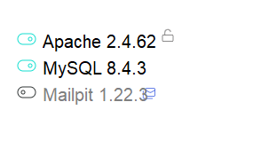

# Setup Windows with Laragon

Instead of using Docker and `sail` as described in the [Setup](./Setup.md), you can use a manual setup. 
For Windows, **you cannot use XAMPP**, because it currently only serves PHP 8.2 and we are running 8.3. Thus, you should use [Laragon](https://laragon.org).

## Windows - Laragon

1. Install Laragon
Download from [Laragon](https://laragon.org)

This includes PHP, Composer, MySQL, Apache and even Nodejs. 

Install it where you want. You're almost done already!

2. Change document root

In Laragon, go to the Settings (top-right wheel icon).
There, you can change the Document root. You can also setup virtual hosts.

3. Add Laragon to path

In the Laragon Panel, right click, then go to `Tools > Path > Add Laragon to Path`.

Restart your IDE (or your computer) after doing this.

4. Activate `zip` PHP extension.

In the Laragon Panel, right click, then go to `PHP > Extensions` and check `zip`.

5. Create a database

In the Laragon Panel, right click, then go to `MySQL > Create Database` and give it the name you want.

6. Copy `.env.example` to `.env` and configure your .env file with the MySQL database name (the one you just created), user (root) and password (empty).

7. Activate SSL

In the Laragon Panel, right click, then go to `Apache > SSL` and check `SSL`.
Or directly click on the lock icon on the home screen :


8. In project directory, run :

```bash
composer install
npm install
npm run build
php artisan generate:key
php artisan migrate:install
php artisan migrate
php artisan db:seed
php artisan storage:link
```

You are up and running on the domain you configured in step 2 (for example, http://esperluettes.test). 
System might redirect you to https://esperluettes.test and tell you the site is not secure. Simply tell your browser everything is ok.

From that point one, you can basically replace all `sail` command by `php` :
- You can use `composer` directly
- But `sail artisan ...` becomes `php artisan ...`

Go to the [First Steps](./Setup.md#first-steps-after-installation) section for the remaining steps

## Working with the app

### Start and stop the environment 
Just go to Laragon and start/stop the Apache server and the mysql server.

### Regenerate javascript and tailwind classes (whenever you touch javascript)

Either once:
> npm run build

Or on every change (very useful for development):
> npm run dev

## Other Essential Laravel Commands
- Artisan commands: `php artisan [command]`
- Composer commands: `composer [command]`
- Database access: Through Laragon panel

### Laravel Commands
- Create model: `php artisan make:model ModelName -m`
- Create controller: `php artisan make:controller ControllerName`
- Run migrations: `php artisan migrate`
- Create migration: `php artisan make:migration create_table_name`
- Create seeder: `php artisan make:seeder TableSeeder`
- Clear cache: `php artisan cache:clear`
- Generate key: `php artisan key:generate`

### Filament Commands (for admin)
- Create resource: `php artisan make:filament-resource ModelName`
- Create user: `php artisan make:filament-user`
- Create page: `php artisan make:filament-page PageName`